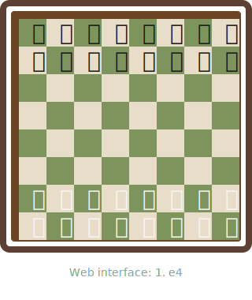

## chess-db
Store chess openings and **train them from memory**—with **Stockfish evaluation** so you don’t learn bad lines.

### What this is for (learning-first)
- **Learn** openings using a built-in trainer:
  - a branching **tree** view (decision points)
  - a chunked **study sheet** (printable “rehearsal” format)
  - spaced-repetition **quizzes** and “what’s due today”
- **Store** openings as SAN move sequences (validated on insert)
- **Evaluate** positions with Stockfish (UCI) so you don’t drill bad lines

### Quickstart: learn (recommended)
```bash
uv sync
uv run chess-db init

# load some lines (examples in scripts/)
uv run python scripts/add_scotch_game.py

# study sheet (chunk=2 => one White move + one Black move per line)
uv run chess-db learn --prefix "Scotch Game" --limit 10 --chunk 2 --depth 10 --swing-cp 120
```



[View SVG directly](docs/learn-didactic-demo.svg) (some editors block SVG images in markdown preview)

### Web interface
Browse openings with an interactive chess board:

```bash
uv run chess-db serve
```

Then open http://127.0.0.1:8080



[View SVG directly](docs/web-board-demo.svg)

**Board features:**
- Click an opening in the sidebar to load it
- Step through moves: **← Prev** / **Next →** or **First** / **Last**
- **Flip** to view from Black’s perspective
- **Keyboard**: `←` `→` arrows or **Space** to step forward
- **Filter** by name (e.g. `Scotch Game`), then **Refresh** after loading new openings
- **Stockfish eval** (optional): toggle to show evaluation after each move (requires Stockfish)

### Setup
#### Prereqs
- **Python**: 3.11+
- **Stockfish engine binary** (recommended)

macOS (Homebrew):

```bash
brew install stockfish
```

#### Install (uv)
```bash
uv sync
uv run chess-db --help
```

### Configuration
- **Database path**
  - default: `./data/chess_db.sqlite3`
  - override: `CHESS_DB_PATH`
- **Stockfish binary**
  - default: `stockfish` on `PATH`
  - override: `STOCKFISH_PATH`

Example:

```bash
export STOCKFISH_PATH="/opt/homebrew/bin/stockfish"
export CHESS_DB_PATH="data/chess_db.sqlite3"
```

### Quickstart (store + evaluate)
```bash
uv run chess-db init
uv run chess-db add "Italian Game" --moves "e4 e5 Nf3 Nc6 Bc4"
uv run chess-db list
uv run chess-db eval "Italian Game" --depth 14
```


[View SVG directly](docs/eval-demo.svg) (some editors block SVG images in markdown preview)

### Learn the Scotch (recommended workflow)
1) **See the decision tree** (what branches after the shared start):

```bash
uv run chess-db tree --prefix "Scotch Game" --levels 3
```

2) **Study sheet** (lines split into chunks you can rehearse):

```bash
uv run chess-db learn --prefix "Scotch Game" --limit 10 --chunk 2
```

3) **Quiz** (opening name → type the first N SAN tokens):

```bash
uv run chess-db quiz --prefix "Scotch Game" --tokens 8
```

4) **Daily review** (spaced repetition):

```bash
uv run chess-db due --prefix "Scotch Game"
```

### Learn output: Stockfish eval + critical moment
By default, `learn` will (if Stockfish is available):
- Print the **final eval** (White POV)
- Highlight the **critical move** (largest eval swing)

Tune it:

```bash
uv run chess-db learn --prefix "Scotch Game" --limit 10 --chunk 2 --depth 10 --swing-cp 120
```

Make it instant:

```bash
uv run chess-db learn --prefix "Scotch Game" --limit 10 --chunk 2 --no-eval
```

If you prefer fewer, longer rehearsal lines, increase chunk size (example demo):


[View SVG directly](docs/learn-demo.svg) (some editors block SVG images in markdown preview)

### Notes / mnemonics (for “why”)
Attach a 1-line plan you’ll see during `show` and after quizzes:

```bash
uv run chess-db note "Scotch Game - Scotch Standard" --text "Default: ...Bc5 -> Be3, c3, Bc4, O-O. Development + central pressure."
uv run chess-db show "Scotch Game - Scotch Standard"
```

### Import scripts
Load the curated Scotch set into your local DB:

```bash
uv run python scripts/add_scotch_game.py
```

Load the Scotch Game Mastery set (paste your lines into the script first):

```bash
uv run python scripts/add_scotch_extended.py
```

Load the Italian Game set (Italian Game) into your local DB:

```bash
uv run python scripts/add_italian_game.py
```

Load the Italian Game Mastery set:

```bash
uv run python scripts/add_italian_extended.py
```

Load the Ponziani Extended set:

```bash
uv run python scripts/add_ponziani_extended.py
```

Import your own lines (e.g. from a course / notes) from a TSV file:

- Format: one line per opening as `<name><TAB><pgn moves>`
- Example:
  - `Scotch Game - Line 01<TAB>1. e4 e5 2. Nf3 Nc6 3. d4 exd4 ...`

```bash
uv run python scripts/import_openings_tsv.py path/to/openings.tsv
```
